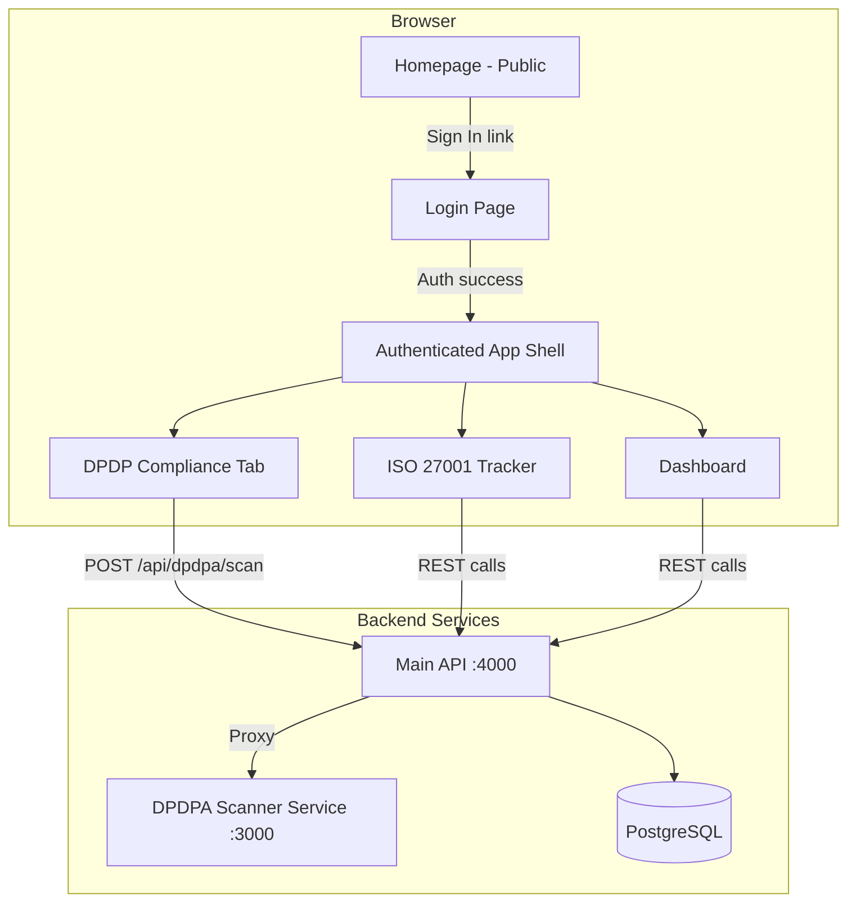
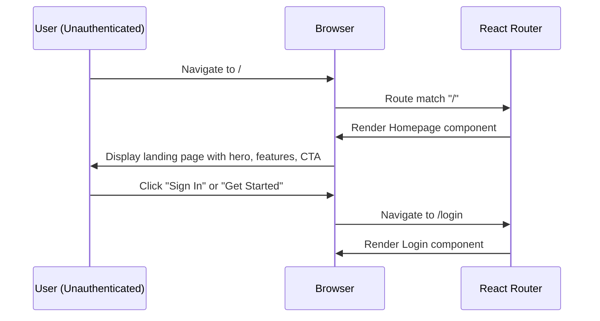
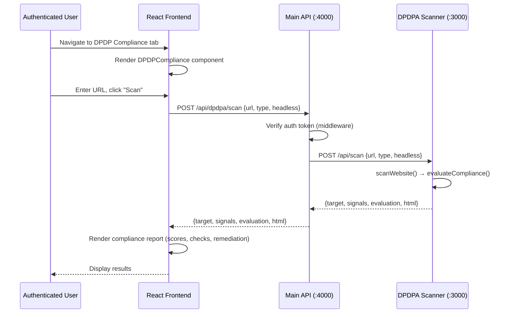
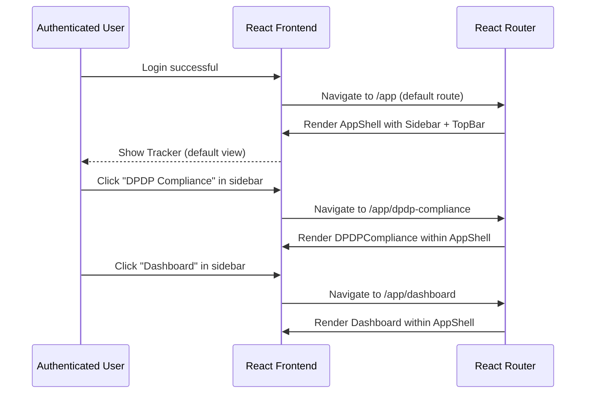

# Design Document: Homepage & DPDP Compliance Integration

## Overview

This feature introduces a public-facing homepage/landing page for the AuditReady 36 application, integrates the existing DPDPA Compliance Scanner as a tab within the authenticated application shell, and restructures the routing so that the existing ISO 27001 compliance features remain accessible after login.

Currently, unauthenticated users are redirected directly to `/login`. The new design adds a marketing/informational homepage at `/` that's accessible without authentication, while the authenticated application (Tracker, Dashboard, DPDP Scanner, etc.) lives under a protected layout. The standalone DPDPA Compliance Scanner (currently a separate Express server on port 3000) will be integrated as a React component that calls the scanner's API, either via a proxy through the main API or directly to the DPDPA service.

## Architecture



## Sequence Diagrams

### Public Homepage Flow



### DPDP Compliance Scan Flow



### Authenticated App Navigation Flow



## Components and Interfaces

### Component 1: Homepage (Public Landing Page)

**Purpose**: Serves as the public entry point for the application. Displays product information, key features, and call-to-action buttons for login/registration.

**Interface**:
```jsx
// web/src/pages/Homepage.jsx
export default function Homepage()
// No props - fully self-contained public page
// Returns: JSX with hero section, feature cards, CTA buttons
```

**Responsibilities**:
- Display hero section with product name and tagline
- Show feature highlights (ISO 27001 Compliance, DPDP Compliance Scanner, Dashboard & Reporting)
- Provide navigation links to Login and Register pages
- Responsive design that works on all screen sizes

### Component 2: AppShell (Authenticated Layout Wrapper)

**Purpose**: Wraps all authenticated pages with the Sidebar and TopBar navigation. Provides consistent layout and navigation context.

**Interface**:
```jsx
// web/src/components/AppShell.jsx
export default function AppShell({ 
  token,        // string - JWT auth token
  user,         // object - {id, email, role, name}
  company,      // object - {id, name}
  branding,     // object - {logoUrl, primaryColor, aiEnabled}
  onLogout,     // function - logout handler
  theme,        // string - "dark" | "light"
  onThemeToggle // function - toggle theme handler
})
// Returns: JSX with Sidebar + TopBar + <Outlet /> for nested routes
```

**Responsibilities**:
- Render the Sidebar with navigation links (Tracker, Dashboard, DPDP Compliance, Review, Admin)
- Render the TopBar with user info, theme toggle, and logout
- Provide consistent layout wrapper for child routes via React Router `<Outlet />`
- Conditionally show navigation items based on user role

### Component 3: DPDPCompliance (Scanner Integration)

**Purpose**: Integrates the DPDPA & GDPR Compliance Scanner functionality as a React component within the authenticated application.

**Interface**:
```jsx
// web/src/pages/DPDPCompliance.jsx
export default function DPDPCompliance({ token, user, company })
// Props:
//   token   - JWT for authenticated API calls
//   user    - current user object
//   company - current company object
// Returns: JSX with scan form, results display, report download
```

**Responsibilities**:
- Provide URL input form for website/mobile app scanning
- Call the main API's DPDPA proxy endpoint with authentication
- Display scan results: overall score, framework scores, category breakdown
- Show remediation priorities and detailed check results
- Allow downloading HTML and JSON reports
- Store scan history for the company (future enhancement)

### Component 4: Updated Sidebar (Navigation)

**Purpose**: Extends the existing Sidebar to support app-wide navigation including the new DPDP Compliance tab.

**Interface**:
```jsx
// web/src/components/AppSidebar.jsx
export default function AppSidebar({
  user,           // object - current user
  currentPath,    // string - current route path
  branding        // object - company branding
})
// Returns: JSX with navigation links styled based on active route
```

**Responsibilities**:
- Display navigation items: Tracker, Dashboard, DPDP Compliance, Review, Admin, Auditors
- Highlight active route
- Conditionally render items based on user role
- Display company logo/branding

## Data Models

### Homepage Content Model (Static)

```javascript
// No database model needed - content is static in the component
const FEATURES = [
  {
    icon: "shield",
    title: "ISO 27001 Compliance",
    description: "Track and manage your ISO 27001 compliance with self-audit capabilities"
  },
  {
    icon: "scan",
    title: "DPDP Compliance Scanner",
    description: "Scan websites for DPDPA 2023 & GDPR compliance with detailed remediation plans"
  },
  {
    icon: "chart",
    title: "Dashboard & Reporting",
    description: "Visual compliance dashboards with export capabilities"
  }
];
```

### DPDP Scan Request/Response

```javascript
// Request: POST /api/dpdpa/scan
const ScanRequest = {
  url: String,           // required - target URL to scan
  type: String,          // "website" | "mobile" (default: "website")
  headless: Boolean,     // optional - deep scan with headless browser
  policy: String | null  // optional - privacy policy URL for mobile apps
};

// Response
const ScanResponse = {
  target: String,        // the scanned URL
  signals: Object,       // raw scanner signals (cookies, trackers, headers, etc.)
  evaluation: {
    overall: { score: Number, grade: String, label: String },
    frameworks: {
      GDPR: { score: Number, grade: String, passed: Number, partial: Number, failed: Number },
      DPDPA: { score: Number, grade: String, passed: Number, partial: Number, failed: Number }
    },
    categoryScores: [{ name: String, score: Number, items: Number }],
    results: [{ id: String, status: String, title: String, detail: String, severity: String }],
    remediation: [{ id: String, severity: String, title: String, recommendation: String }]
  },
  html: String           // pre-rendered HTML report for download
};
```

**Validation Rules**:
- `url` must be a non-empty string
- `url` must be a valid URL format (with or without protocol prefix)
- `type` must be either "website" or "mobile"
- Only authenticated users can trigger scans

### Route Configuration Model

```javascript
// New route structure
const ROUTES = {
  public: [
    { path: "/", component: "Homepage" },
    { path: "/login", component: "Login" },
    { path: "/register", component: "Register" },
    { path: "/accept-invite/:token", component: "AcceptInvite" }
  ],
  authenticated: {
    layout: "AppShell",
    basePath: "/app",
    children: [
      { path: "", component: "Tracker", roles: ["ADMIN", "LEAD"] },
      { path: "dashboard", component: "Dashboard", roles: ["ALL"] },
      { path: "dpdp-compliance", component: "DPDPCompliance", roles: ["ALL"] },
      { path: "review", component: "Review", roles: ["ADMIN", "LEAD", "VIEWER"] },
      { path: "admin", component: "AdminPanel", roles: ["ADMIN"] },
      { path: "auditors", component: "AuditorPanel", roles: ["ADMIN"] },
      { path: "superadmin", component: "SuperAdminDashboard", roles: ["SUPERADMIN"] }
    ]
  }
};
```

## Algorithmic Pseudocode

### Route Resolution Algorithm

```pascal
ALGORITHM resolveRoute(path, authState)
INPUT: path (String), authState ({token, user, company})
OUTPUT: component to render or redirect target

BEGIN
  isAuthenticated ← authState.token IS NOT NULL
  role ← authState.user?.role

  // Public routes - accessible to all
  IF path = "/" AND NOT isAuthenticated THEN
    RETURN render(Homepage)
  END IF

  IF path = "/login" THEN
    IF isAuthenticated THEN
      RETURN redirect(getDefaultAuthRoute(role))
    ELSE
      RETURN render(Login)
    END IF
  END IF

  IF path = "/register" THEN
    IF isAuthenticated THEN
      RETURN redirect(getDefaultAuthRoute(role))
    ELSE
      RETURN render(Register)
    END IF
  END IF

  // Authenticated routes - require login
  IF path STARTS WITH "/app" THEN
    IF NOT isAuthenticated THEN
      RETURN redirect("/login")
    END IF

    subPath ← path WITHOUT "/app" prefix

    IF subPath = "" OR subPath = "/" THEN
      RETURN render(AppShell + Tracker)
    ELSE IF subPath = "/dashboard" THEN
      RETURN render(AppShell + Dashboard)
    ELSE IF subPath = "/dpdp-compliance" THEN
      RETURN render(AppShell + DPDPCompliance)
    ELSE IF subPath = "/review" AND role IN ["ADMIN", "LEAD", "VIEWER"] THEN
      RETURN render(AppShell + Review)
    ELSE IF subPath = "/admin" AND role = "ADMIN" THEN
      RETURN render(AppShell + AdminPanel)
    END IF
  END IF

  // Root path when authenticated → redirect to app
  IF path = "/" AND isAuthenticated THEN
    RETURN redirect("/app")
  END IF

  // Fallback
  RETURN redirect(isAuthenticated ? "/app" : "/")
END
```

**Preconditions:**
- `path` is a non-empty string starting with "/"
- `authState` is a valid object (may have null token)

**Postconditions:**
- Always returns either a render instruction or a redirect
- Authenticated users never see public-only pages
- Unauthenticated users never see protected pages
- Role-restricted pages enforce role checks

### DPDPA Proxy Request Algorithm

```pascal
ALGORITHM handleDPDPAScanProxy(request, authToken)
INPUT: request (HTTP POST body), authToken (JWT)
OUTPUT: scan results or error response

BEGIN
  // Step 1: Authenticate
  user ← verifyJWT(authToken)
  IF user IS NULL THEN
    RETURN HTTP 401 { error: "Unauthorized" }
  END IF

  // Step 2: Validate input
  url ← request.body.url
  IF url IS NULL OR url IS EMPTY THEN
    RETURN HTTP 400 { error: "Provide a URL" }
  END IF

  type ← request.body.type OR "website"
  headless ← request.body.headless OR false
  policy ← request.body.policy OR null

  // Step 3: Forward to DPDPA service
  dpdpaServiceUrl ← ENVIRONMENT.DPDPA_SERVICE_URL OR "http://localhost:3000"

  TRY
    response ← HTTP_POST(
      dpdpaServiceUrl + "/api/scan",
      body: { url, type, headless, policy },
      timeout: 60000
    )

    IF response.status IS NOT OK THEN
      errorData ← response.json()
      RETURN HTTP response.status { error: errorData.error }
    END IF

    data ← response.json()
    RETURN HTTP 200 data

  CATCH error
    RETURN HTTP 502 { error: "DPDPA scanner service unavailable" }
  END TRY
END
```

**Preconditions:**
- Auth middleware has validated the JWT token
- DPDPA scanner service is running and accessible
- Request body contains valid JSON

**Postconditions:**
- Returns scan results on success (200)
- Returns appropriate error codes on failure (400, 401, 502)
- Never exposes internal service URLs to the client
- Request is proxied with timeout protection

### Default Route Resolution by Role

```pascal
ALGORITHM getDefaultAuthRoute(role)
INPUT: role (String - user role)
OUTPUT: path (String - default route for the role)

BEGIN
  MATCH role WITH
    "SUPERADMIN" → RETURN "/app/superadmin"
    "AUDITOR"    → RETURN "/app/dashboard"
    "VIEWER"     → RETURN "/app/review"
    "ADMIN"      → RETURN "/app"
    "LEAD"       → RETURN "/app"
    DEFAULT      → RETURN "/app/dashboard"
  END MATCH
END
```

**Preconditions:**
- `role` is a valid role string from the user object

**Postconditions:**
- Always returns a valid authenticated route path
- Route matches the user's primary workflow

## Key Functions with Formal Specifications

### Function 1: Homepage Component

```jsx
export default function Homepage()
```

**Preconditions:**
- User is NOT authenticated (enforced by route guard)
- React Router context is available

**Postconditions:**
- Renders a complete landing page with hero, features, and CTA
- Contains accessible navigation links to /login and /register
- No API calls made (fully static content)

### Function 2: DPDPCompliance.handleScan()

```jsx
async function handleScan(url, type, headless, policy)
```

**Preconditions:**
- `url` is a non-empty string
- `token` is available in component scope (user is authenticated)
- API service is reachable

**Postconditions:**
- On success: `scanResult` state contains valid evaluation data
- On error: `error` state contains descriptive error message
- Loading state is set to false regardless of outcome
- No unhandled promise rejections

### Function 3: API Proxy Route Handler

```javascript
// api/src/routes/dpdpa.js
router.post("/scan", authMiddleware, async (req, res) => { ... })
```

**Preconditions:**
- Request has passed auth middleware (valid JWT in header)
- `req.body.url` exists and is a string
- DPDPA service URL is configured in environment

**Postconditions:**
- Successful scan: returns 200 with {target, signals, evaluation, html}
- Invalid input: returns 400 with error message
- Service unavailable: returns 502 with descriptive error
- Auth failure: returns 401 (handled by middleware before this function)

### Function 4: AppShell Layout

```jsx
export default function AppShell({ token, user, company, branding, onLogout, theme, onThemeToggle })
```

**Preconditions:**
- `token` is a valid non-null JWT string
- `user` object has at minimum: id, email, role
- React Router `<Outlet />` context is available

**Postconditions:**
- Renders sidebar navigation with role-appropriate links
- Renders top bar with user info and controls
- Child route content renders in the main content area
- Sidebar active state matches current URL

## Example Usage

### Homepage Navigation

```jsx
// In App.jsx - Updated routing structure
import Homepage from "./pages/Homepage.jsx";
import DPDPCompliance from "./pages/DPDPCompliance.jsx";
import AppShell from "./components/AppShell.jsx";

<Routes>
  {/* Public routes */}
  <Route path="/" element={isAuthenticated ? <Navigate to="/app" /> : <Homepage />} />
  <Route path="/login" element={isAuthenticated ? <Navigate to="/app" /> : <Login onLogin={handleLogin} />} />
  <Route path="/register" element={isAuthenticated ? <Navigate to="/app" /> : <Register />} />

  {/* Authenticated routes under /app */}
  <Route path="/app" element={isAuthenticated ? <AppShell {...authProps} /> : <Navigate to="/login" />}>
    <Route index element={<Tracker {...authProps} />} />
    <Route path="dashboard" element={<Dashboard {...authProps} />} />
    <Route path="dpdp-compliance" element={<DPDPCompliance {...authProps} />} />
    <Route path="review" element={<Review {...authProps} />} />
    <Route path="admin" element={<AdminPanel {...authProps} />} />
    <Route path="auditors" element={<AuditorPanel {...authProps} />} />
    <Route path="superadmin" element={<SuperAdminDashboard {...authProps} />} />
  </Route>

  <Route path="*" element={<Navigate to={isAuthenticated ? "/app" : "/"} />} />
</Routes>
```

### DPDP Compliance Scan Usage

```jsx
// Inside DPDPCompliance component
const [url, setUrl] = useState("");
const [scanType, setScanType] = useState("website");
const [headless, setHeadless] = useState(false);
const [result, setResult] = useState(null);
const [loading, setLoading] = useState(false);
const [error, setError] = useState("");

const handleScan = async () => {
  if (!url.trim()) return setError("Please enter a URL");
  setLoading(true);
  setError("");
  setResult(null);

  try {
    const data = await apiFetch("/api/dpdpa/scan", {
      token,
      method: "POST",
      body: JSON.stringify({ url: url.trim(), type: scanType, headless })
    });
    setResult(data);
  } catch (err) {
    setError(err.message);
  } finally {
    setLoading(false);
  }
};
```

### API Proxy Route Setup

```javascript
// api/src/routes/dpdpa.js
import { Router } from "express";
import { authenticate } from "../middleware/auth.js";

const router = Router();
const DPDPA_SERVICE = process.env.DPDPA_SERVICE_URL || "http://localhost:3000";

router.post("/scan", authenticate, async (req, res) => {
  const { url, type = "website", headless = false, policy = null } = req.body;
  if (!url || typeof url !== "string") {
    return res.status(400).json({ error: 'Provide a "url".' });
  }

  try {
    const response = await fetch(`${DPDPA_SERVICE}/api/scan`, {
      method: "POST",
      headers: { "Content-Type": "application/json" },
      body: JSON.stringify({ url, type, headless, policy })
    });
    const data = await response.json();

    if (!response.ok) {
      return res.status(response.status).json(data);
    }
    res.json(data);
  } catch (err) {
    res.status(502).json({ error: "DPDPA scanner service unavailable" });
  }
});

export default router;
```

## Correctness Properties

*A property is a characteristic or behavior that should hold true across all valid executions of a system—essentially, a formal statement about what the system should do. Properties serve as the bridge between human-readable specifications and machine-verifiable correctness guarantees.*

### Property 1: Route Guard Invariant

*For any* path under `/app/*` and *for any* unauthenticated user, the route resolver SHALL produce a redirect to `/login`.

**Validates: Requirements 2.1**

### Property 2: Public Access Invariant

*For any* unauthenticated user navigating to `/`, the route resolver SHALL render the Homepage without requiring authentication. *For any* authenticated user navigating to `/`, the route resolver SHALL redirect to `/app`.

**Validates: Requirements 1.1, 1.5**

### Property 3: Role-Based Default Route Completeness

*For any* user role in {SUPERADMIN, ADMIN, LEAD, AUDITOR, VIEWER}, the `getDefaultAuthRoute` function SHALL return a valid route path that exists in the application route configuration.

**Validates: Requirements 2.4, 2.5, 2.6, 2.7**

### Property 4: Role-Based Navigation Visibility

*For any* navigation item rendered in the Sidebar and *for any* user, the item is visible only if the user's role is in the item's allowed roles set. Specifically, Admin and Auditors items are visible only to ADMIN users.

**Validates: Requirements 3.4, 3.5, 7.4**

### Property 5: Scan Result Score Bounds

*For any* successful scan response, the `evaluation.overall.score`, `evaluation.frameworks.GDPR.score`, and `evaluation.frameworks.DPDPA.score` values SHALL be numbers between 0 and 100 inclusive.

**Validates: Requirements 6.1, 6.2**

### Property 6: Service URL Isolation

*For any* response returned from the `/api/dpdpa/*` endpoints, the response body SHALL NOT contain the internal `DPDPA_SERVICE_URL` value.

**Validates: Requirements 5.8**

### Property 7: Scan Proxy Transparency

*For any* valid authenticated scan request with a non-empty URL, the API proxy SHALL forward the request to the DPDPA Scanner Service and return the response status and body unchanged.

**Validates: Requirements 5.3, 5.4, 5.5**

### Property 8: Role-Based Route Access Control

*For any* user without the ADMIN role attempting to navigate to `/app/admin` or `/app/auditors`, the Route Guard SHALL redirect to the user's default route rather than rendering the restricted page.

**Validates: Requirements 7.1, 7.2**

### Property 9: Fallback Route Resolution

*For any* unrecognized path, the route resolver SHALL redirect to `/app` if the user is authenticated, or `/` if the user is unauthenticated.

**Validates: Requirements 2.8**

## Error Handling

### Error Scenario 1: DPDPA Service Unavailable

**Condition**: The DPDPA Scanner service (port 3000) is down or unreachable when a user triggers a scan.
**Response**: Return HTTP 502 with message "DPDPA scanner service unavailable". Display user-friendly error in the UI.
**Recovery**: User can retry the scan. The service should be monitored and auto-restarted via Docker Compose restart policy.

### Error Scenario 2: Invalid Scan URL

**Condition**: User enters an invalid or unreachable URL for scanning.
**Response**: The DPDPA service returns HTTP 422 with a descriptive error message. The proxy forwards this to the frontend.
**Recovery**: Display error message and allow user to correct the URL and retry.

### Error Scenario 3: Authentication Expired During Scan

**Condition**: User's JWT expires during a long-running scan (headless scans can take 30+ seconds).
**Response**: The API returns 401. The frontend catches this and redirects to login.
**Recovery**: User logs in again and can re-trigger the scan.

### Error Scenario 4: Navigation to Unauthorized Route

**Condition**: User manually enters a URL for a route their role doesn't permit (e.g., non-admin visiting /app/admin).
**Response**: Redirect to user's default route based on role.
**Recovery**: Automatic - user lands on their appropriate default page.

## Testing Strategy

### Unit Testing Approach

- Test Homepage component renders correctly without props
- Test AppShell renders sidebar navigation based on role
- Test DPDPCompliance component handles loading/error/success states
- Test route guards redirect appropriately for auth/unauth states
- Test API proxy route validates input and handles service errors

### Property-Based Testing Approach

**Property Test Library**: fast-check (compatible with the existing Vite + React setup)

- **Route resolution**: For any valid role and auth state combination, the route resolver always returns a valid route (never undefined)
- **Score bounds**: For any scan result, all scores are integers between 0 and 100
- **Role visibility**: For any set of nav items and any user role, only permitted items are rendered

### Integration Testing Approach

- End-to-end test: Unauthenticated user sees homepage, clicks login, authenticates, sees app shell with DPDP tab
- DPDPA proxy integration: Verify the main API correctly proxies requests to the DPDPA service and returns results
- Docker Compose integration: Verify all services start correctly and can communicate

## Performance Considerations

- **Homepage**: Fully static React component with no API calls — fast initial render
- **DPDP Scanner**: Scans can take 5-30 seconds (especially headless mode). The UI should show clear loading states and allow cancellation
- **Lazy Loading**: DPDPCompliance component should be lazily loaded via `React.lazy()` since not all users will use it
- **Service Communication**: The DPDPA proxy adds minimal overhead (~5ms) compared to direct service calls. The timeout should be set to 60s to accommodate slow scans

## Security Considerations

- **DPDPA Service Isolation**: The DPDPA scanner runs in a separate container/process. The main API proxies requests, preventing direct client access to the scanner service
- **Authentication Required**: All scan operations require a valid JWT. No anonymous scans are permitted through the integrated interface
- **Input Validation**: URLs are validated on both the API proxy and the DPDPA service to prevent SSRF attacks against internal services
- **Rate Limiting**: Consider adding rate limiting on the scan endpoint to prevent abuse (headless scans are resource-intensive)
- **No Secret Exposure**: DPDPA service URL and internal network topology are never exposed to the client

## Dependencies

### Frontend (web/)
- `react-router-dom` (existing) — for nested routing with `<Outlet />`
- No new dependencies required — uses existing React, Vite, and react-router-dom

### Backend (api/)
- Node.js built-in `fetch` (Node 18+) — for proxying requests to DPDPA service
- No new npm packages required

### Infrastructure
- DPDPA Compliance Scanner service added to Docker Compose
- New environment variable: `DPDPA_SERVICE_URL` pointing to the scanner service
- Docker networking allows api container to reach dpdpa container

### Docker Compose Addition
```yaml
dpdpa-scanner:
  build: ./DPDPA Complaince/DPDPA Complaince
  environment:
    PORT: 3000
  ports:
    - "3000:3000"
  restart: unless-stopped
```
