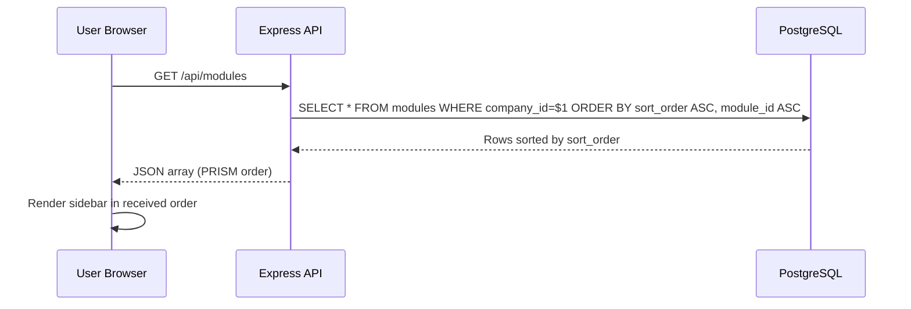
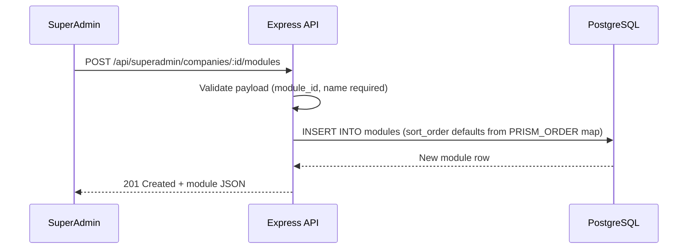
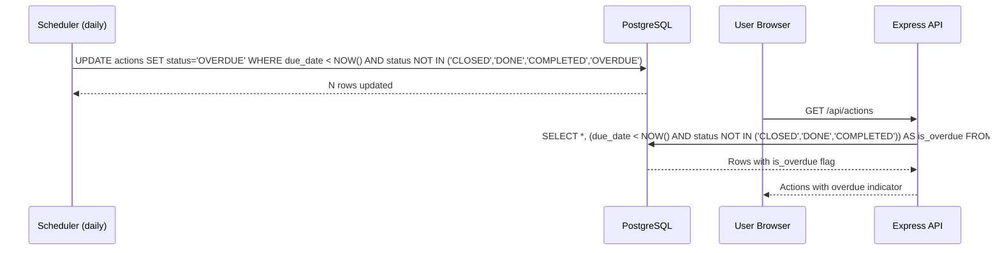

# Design Document: Module Ordering & Overdue Marking

## Overview

This feature introduces three improvements to the PRISM compliance tracker:

1. **Module ordering in the tracker sidebar** — Modules are displayed in the canonical PRISM order (P → R → I → S → M) instead of arbitrary database ordering. A `sort_order` column on the modules table allows SuperAdmin to override ordering per company.

2. **SuperAdmin per-company module/quest management** — Extends the existing company detail view so SuperAdmin can add individual modules and questions (beyond just Excel import), and delete individual modules with their associated questions.

3. **Overdue task marking** — Actions whose `due_date` has passed without closure are automatically surfaced with an "OVERDUE" status. A scheduled job updates stale actions, and the frontend displays an overdue indicator.

## Architecture

```mermaid
graph TD
    subgraph Frontend ["Frontend (React/Vite)"]
        Sidebar[Sidebar.jsx]
        SAD[SuperAdminDashboard.jsx]
        ActionList[Action Views]
    end

    subgraph API ["API (Express)"]
        ModulesRoute[/api/modules]
        SuperAdminRoute[/api/superadmin]
        ActionsRoute[/api/actions]
        Scheduler[Scheduler - Cron Jobs]
    end

    subgraph DB ["PostgreSQL"]
        ModulesTable[modules table]
        QuestionsTable[questions table]
        ActionsTable[actions table]
    end

    Sidebar -->|GET sorted modules| ModulesRoute
    SAD -->|POST/DELETE individual| SuperAdminRoute
    ActionList -->|GET with overdue flag| ActionsRoute
    Scheduler -->|UPDATE overdue status| ActionsTable

    ModulesRoute --> ModulesTable
    SuperAdminRoute --> ModulesTable
    SuperAdminRoute --> QuestionsTable
    ActionsRoute --> ActionsTable
```

## Sequence Diagrams

### Module Ordering Flow



### SuperAdmin Add Module Flow



### Overdue Marking Flow



## Components and Interfaces

### Component 1: Module Ordering (Backend)

**Purpose**: Ensure modules are returned in PRISM canonical order with SuperAdmin override capability.

**Interface**:
```javascript
// PRISM canonical order map
const PRISM_ORDER = {
  'P': 1,  // Policies & Governance
  'R': 2,  // Risk & Resiliency
  'I': 3,  // Identity & People
  'S': 4,  // Security Architecture
  'M': 5   // Management Review & Audit
};

// GET /api/modules - returns modules sorted by sort_order
// GET /api/superadmin/companies/:id/modules - returns modules sorted by sort_order
// PATCH /api/superadmin/companies/:companyId/modules/:moduleId/order - update sort_order
```

**Responsibilities**:
- Add `sort_order` INTEGER column to modules table (default derived from PRISM_ORDER)
- Modify all module queries to ORDER BY sort_order ASC, module_id ASC
- Provide endpoint for SuperAdmin to adjust sort_order
- Auto-assign sort_order on module creation based on module_id prefix letter

### Component 2: Individual Module/Quest Management (Backend)

**Purpose**: Allow SuperAdmin to add and delete individual modules and questions for a company.

**Interface**:
```javascript
// POST /api/superadmin/companies/:id/modules - add single module
// DELETE /api/superadmin/companies/:id/modules/:moduleId - delete single module + its questions
// POST /api/superadmin/companies/:id/questions - add single question
// DELETE /api/superadmin/companies/:id/questions/:questId - delete single question
```

**Responsibilities**:
- Validate required fields on creation
- Cascade delete questions when a module is removed
- Prevent duplicate module_id per company
- Return proper error codes for conflicts and not-found

### Component 3: Overdue Task Marking (Backend)

**Purpose**: Automatically identify and mark actions that are past their due date.

**Interface**:
```javascript
// Scheduler function - runs daily
async function markOverdueActions() { ... }

// GET /api/actions - returns computed is_overdue field
// Response shape includes: { ...action, isOverdue: boolean }
```

**Responsibilities**:
- Daily scheduled job marks open actions past due_date as "OVERDUE"
- GET /api/actions computes an `is_overdue` flag in real-time for display
- Actions with status CLOSED/DONE/COMPLETED are never marked overdue
- Preserve original status in a way that allows reverting if due_date is extended

### Component 4: Frontend - Sidebar Ordering

**Purpose**: Display modules in the order returned by the API (no client-side re-sorting needed).

**Responsibilities**:
- Trust API ordering (remove any client-side sort logic)
- No changes needed if Sidebar already renders modules in array order

### Component 5: Frontend - SuperAdmin Module Management UI

**Purpose**: UI for adding/deleting individual modules and questions.

**Responsibilities**:
- Add "Add Module" form in company detail view
- Add delete button per module row (with confirmation)
- Add "Add Question" form within module expansion
- Add delete button per question (with confirmation)

### Component 6: Frontend - Overdue Indicator

**Purpose**: Visual indicator for overdue actions in action lists.

**Responsibilities**:
- Show red "OVERDUE" badge when `isOverdue` is true or status is "OVERDUE"
- Style overdue rows distinctly in action tables
- Include overdue in status filter options

## Data Models

### Migration: Add sort_order to modules

```sql
ALTER TABLE modules ADD COLUMN IF NOT EXISTS sort_order INTEGER DEFAULT 0;

-- Backfill existing data based on PRISM order
UPDATE modules SET sort_order = 1 WHERE module_id LIKE 'P%';
UPDATE modules SET sort_order = 2 WHERE module_id LIKE 'R%';
UPDATE modules SET sort_order = 3 WHERE module_id LIKE 'I%';
UPDATE modules SET sort_order = 4 WHERE module_id LIKE 'S%';
UPDATE modules SET sort_order = 5 WHERE module_id LIKE 'M%';
```

**Validation Rules**:
- `sort_order` is a non-negative integer
- Default value is derived from the first letter of `module_id` using PRISM_ORDER map
- If module_id prefix doesn't match P/R/I/S/M, sort_order defaults to 99 (appended at end)

### Module Creation Payload

```javascript
// POST /api/superadmin/companies/:id/modules
{
  moduleId: "P - Policies & Governance",  // required, TEXT
  name: "Policies & Governance",           // required, TEXT
  primaryOwner: "CISO",                    // optional, TEXT
  frequency: "Monthly",                    // optional, TEXT
  totalQuests: 12,                         // optional, INT
  purpose: "Establish governance...",       // optional, TEXT
  sortOrder: 1                             // optional, INT (auto-derived if omitted)
}
```

### Question Creation Payload

```javascript
// POST /api/superadmin/companies/:id/questions
{
  questId: "P-1.1",                        // required, TEXT
  moduleId: "P - Policies & Governance",   // required, TEXT (must exist for company)
  controlArea: "Policy Documentation",     // optional, TEXT
  isoReference: "A.5.1",                   // optional, TEXT
  baselineQuestion: "Is there a...",       // optional, TEXT
  level3YesCriteria: "Documented and...",  // optional, TEXT
  requiredEvidence: "Policy document",     // optional, TEXT
  defaultOwner: "CISO",                    // optional, TEXT
  frequency: "Annual"                      // optional, TEXT
}
```

## Algorithmic Pseudocode

### PRISM Sort Order Derivation

```javascript
const PRISM_ORDER = { 'P': 1, 'R': 2, 'I': 3, 'S': 4, 'M': 5 };

function deriveSortOrder(moduleId) {
  // INPUT: moduleId string e.g. "P - Policies & Governance"
  // OUTPUT: integer sort_order
  // PRECONDITION: moduleId is a non-empty string
  // POSTCONDITION: returns integer 1-5 for PRISM modules, 99 for unknown

  const prefix = moduleId.trim().charAt(0).toUpperCase();
  return PRISM_ORDER[prefix] ?? 99;
}
```

**Preconditions:**
- `moduleId` is a non-empty string

**Postconditions:**
- Returns integer in range [1, 99]
- For known PRISM prefixes (P, R, I, S, M), returns the canonical position (1-5)
- For unknown prefixes, returns 99

### Overdue Detection Algorithm

```javascript
async function markOverdueActions() {
  // INPUT: none (reads from actions table)
  // OUTPUT: count of updated rows
  // PRECONDITION: database is available
  // POSTCONDITION: all open actions past due_date have status = 'OVERDUE'

  const NON_OVERDUE_STATUSES = ['CLOSED', 'DONE', 'COMPLETED', 'OVERDUE'];

  const result = await query(`
    UPDATE actions
    SET status = 'OVERDUE', updated_at = NOW()
    WHERE due_date IS NOT NULL
      AND due_date < NOW()
      AND (status IS NULL OR UPPER(status) NOT IN ($1, $2, $3, $4))
    RETURNING id
  `, NON_OVERDUE_STATUSES);

  return result.rowCount;
}
```

**Preconditions:**
- Database connection is available
- `actions` table exists with `due_date`, `status`, `updated_at` columns

**Postconditions:**
- All actions where `due_date < NOW()` and status is not already terminal have `status = 'OVERDUE'`
- `updated_at` is refreshed for all modified rows
- Actions with null `due_date` are not affected
- Already-closed actions are never modified

**Loop Invariants:** N/A (single SQL statement)

### Real-time Overdue Computation on GET

```javascript
async function getActionsWithOverdue(companyId, filters) {
  // INPUT: companyId (integer), optional filters
  // OUTPUT: array of action objects with computed isOverdue boolean
  // PRECONDITION: companyId is a valid company ID
  // POSTCONDITION: each action has isOverdue = true iff due_date < NOW() and not closed

  const result = await query(`
    SELECT *,
      CASE
        WHEN due_date IS NOT NULL
          AND due_date < NOW()
          AND COALESCE(UPPER(status), 'OPEN') NOT IN ('CLOSED', 'DONE', 'COMPLETED')
        THEN true
        ELSE false
      END AS is_overdue
    FROM actions
    WHERE company_id = $1
    ORDER BY
      CASE WHEN due_date < NOW() AND COALESCE(UPPER(status),'OPEN') NOT IN ('CLOSED','DONE','COMPLETED') THEN 0 ELSE 1 END,
      due_date ASC NULLS LAST,
      created_at DESC
  `, [companyId]);

  return mapRows(result); // camelCase mapping handles is_overdue -> isOverdue
}
```

**Preconditions:**
- `companyId` corresponds to an existing company

**Postconditions:**
- Returns all actions for the company
- Each action includes `isOverdue` boolean computed at query time
- Overdue actions are sorted to the top
- Actions with null due_date have `isOverdue = false`

### SuperAdmin Add Module with Auto Sort Order

```javascript
async function addModuleForCompany(companyId, payload) {
  // INPUT: companyId (int), payload with moduleId, name, etc.
  // OUTPUT: created module row
  // PRECONDITION: company exists, moduleId is unique for company
  // POSTCONDITION: module exists in DB with correct sort_order

  const sortOrder = payload.sortOrder ?? deriveSortOrder(payload.moduleId);

  const result = await query(
    `INSERT INTO modules (module_id, company_id, name, primary_owner, frequency, total_quests, purpose, sort_order)
     VALUES ($1, $2, $3, $4, $5, $6, $7, $8)
     RETURNING *`,
    [payload.moduleId, companyId, payload.name, payload.primaryOwner || null,
     payload.frequency || null, payload.totalQuests || null, payload.purpose || null, sortOrder]
  );

  return mapRow(result);
}
```

**Preconditions:**
- `companyId` exists in companies table
- `payload.moduleId` is not already used for this company
- `payload.name` is a non-empty string

**Postconditions:**
- New module row exists with the given company_id
- `sort_order` is either explicitly provided or auto-derived from module_id prefix
- Returns the created module with all fields

### SuperAdmin Delete Single Module (Cascade)

```javascript
async function deleteModuleForCompany(companyId, moduleId) {
  // INPUT: companyId (int), moduleId (text)
  // OUTPUT: { deleted: boolean }
  // PRECONDITION: companyId and moduleId identify an existing module
  // POSTCONDITION: module and all its questions are removed

  const client = await getClient();
  try {
    await client.query('BEGIN');

    // Delete questions first (or rely on application-level cascade)
    await client.query(
      "DELETE FROM questions WHERE module_id = $1 AND company_id = $2",
      [moduleId, companyId]
    );

    const result = await client.query(
      "DELETE FROM modules WHERE module_id = $1 AND company_id = $2 RETURNING id",
      [moduleId, companyId]
    );

    if (result.rowCount === 0) {
      await client.query('ROLLBACK');
      return { deleted: false, error: 'Module not found' };
    }

    await client.query('COMMIT');
    return { deleted: true };
  } catch (err) {
    await client.query('ROLLBACK');
    throw err;
  } finally {
    client.release();
  }
}
```

**Preconditions:**
- `companyId` is a valid company ID
- `moduleId` is the text module_id (e.g., "P - Policies & Governance")

**Postconditions:**
- If module existed: module row and all associated question rows are deleted
- If module didn't exist: returns `{ deleted: false }`, no data modified
- Transaction ensures atomicity — either both module and questions are deleted or neither

## Key Functions with Formal Specifications

### Function: deriveSortOrder(moduleId)

```javascript
function deriveSortOrder(moduleId) {
  const prefix = moduleId.trim().charAt(0).toUpperCase();
  return PRISM_ORDER[prefix] ?? 99;
}
```

**Preconditions:**
- `moduleId` is a non-null, non-empty string

**Postconditions:**
- Returns integer
- `deriveSortOrder("P - ...") === 1`
- `deriveSortOrder("R - ...") === 2`
- `deriveSortOrder("I - ...") === 3`
- `deriveSortOrder("S - ...") === 4`
- `deriveSortOrder("M - ...") === 5`
- `deriveSortOrder("X - ...") === 99`

### Function: isActionOverdue(action)

```javascript
function isActionOverdue(action) {
  if (!action.dueDate) return false;
  const closedStatuses = ['CLOSED', 'DONE', 'COMPLETED'];
  if (closedStatuses.includes((action.status || '').toUpperCase())) return false;
  return new Date(action.dueDate) < new Date();
}
```

**Preconditions:**
- `action` is an object with optional `dueDate` (ISO string or Date) and optional `status` (string)

**Postconditions:**
- Returns `false` if `dueDate` is null/undefined
- Returns `false` if status is CLOSED, DONE, or COMPLETED (case-insensitive)
- Returns `true` if and only if `dueDate` is in the past and action is not closed
- No side effects

## Example Usage

### Sidebar renders modules in PRISM order (no change needed)

```javascript
// Sidebar.jsx - modules prop is already rendered in array order
// The API now returns them sorted by sort_order
{modules.map((module) => (
  <div key={module.moduleId} className="module-group">
    <button className={`module-btn ${isActive ? "active" : ""}`}>
      <div className="module-id">{module.moduleId}</div>
      <div className="module-name">{module.name}</div>
    </button>
  </div>
))}
```

### SuperAdmin adds a module

```javascript
// In SuperAdminDashboard.jsx
const handleAddModule = async () => {
  const res = await apiFetch(`/api/superadmin/companies/${selectedCompany.id}/modules`, {
    method: 'POST',
    body: JSON.stringify({
      moduleId: newModuleId,
      name: newModuleName,
      primaryOwner: newOwner || undefined,
      frequency: newFrequency || undefined,
    }),
  });
  if (res.ok) {
    showToast("Module added");
    refreshModules();
  }
};
```

### Overdue indicator in action list

```javascript
// In action list component
{actions.map(action => (
  <tr key={action.id} className={action.isOverdue ? 'row-overdue' : ''}>
    <td>{action.defeatedQuest}</td>
    <td>{action.owner}</td>
    <td>{action.dueDate ? new Date(action.dueDate).toLocaleDateString() : '—'}</td>
    <td>
      {action.isOverdue && <span className="badge badge-overdue">OVERDUE</span>}
      {!action.isOverdue && <span className="badge">{action.status || 'OPEN'}</span>}
    </td>
  </tr>
))}
```

## Correctness Properties

*A property is a characteristic or behavior that should hold true across all valid executions of a system — essentially, a formal statement about what the system should do. Properties serve as the bridge between human-readable specifications and machine-verifiable correctness guarantees.*

### Property 1: PRISM Sort Order Derivation

*For any* non-empty module_id string, `deriveSortOrder` SHALL return the canonical PRISM position (1 for "P", 2 for "R", 3 for "I", 4 for "S", 5 for "M") when the first character matches a known prefix, and 99 for any other prefix character.

**Validates: Requirements 1.2, 1.3, 1.4, 1.5, 1.6, 1.7, 4.3**

### Property 2: Explicit Sort Order Override

*For any* module creation request that includes an explicit sort_order value, the System SHALL use the provided sort_order and ignore the value that would be derived from the module_id prefix.

**Validates: Requirements 1.8**

### Property 3: Module List Ordering

*For any* set of modules returned by the modules API, the list SHALL be sorted such that for every adjacent pair (modules[i], modules[i+1]), either modules[i].sortOrder < modules[i+1].sortOrder, or modules[i].sortOrder === modules[i+1].sortOrder and modules[i].moduleId <= modules[i+1].moduleId.

**Validates: Requirements 2.1, 2.2, 2.3**

### Property 4: Overdue Detection Correctness

*For any* action object, `isActionOverdue` SHALL return true if and only if: (a) due_date is not null, AND (b) due_date is in the past, AND (c) status is not in the set {CLOSED, DONE, COMPLETED}. In all other cases it SHALL return false.

**Validates: Requirements 8.2, 8.3, 8.4, 8.5**

### Property 5: Scheduler Overdue Marking Idempotency

*For any* set of actions in the database, running `markOverdueActions` multiple times produces the same final state as running it once — actions already marked OVERDUE are not modified again.

**Validates: Requirements 9.2, 9.4**

### Property 6: Scheduler Preserves Terminal Actions

*For any* action with a Terminal_Status (CLOSED, DONE, COMPLETED), the Scheduler SHALL never modify the action's status, even if due_date is in the past.

**Validates: Requirements 9.3, 8.5**

### Property 7: Cascade Delete Atomicity

*For any* module with N associated questions, deleting the module SHALL result in both the module and all N questions being removed. If the transaction fails, neither the module nor any questions are removed.

**Validates: Requirements 5.1, 5.3**

### Property 8: Question Referential Integrity

*For any* question creation request, if the referenced module_id does not exist for the specified company, the System SHALL reject the request and no question is created.

**Validates: Requirements 6.2**

### Property 9: Action List Sort Priority

*For any* list of actions returned by the API, all overdue actions SHALL appear before non-overdue actions, overdue actions SHALL be sorted by due_date ascending, and actions with null due_date SHALL appear after actions with due dates.

**Validates: Requirements 10.1, 10.2, 10.3**

### Property 10: Access Control Enforcement

*For any* user without SuperAdmin role, all module and question management operations (create, delete, reorder) SHALL be rejected with a 403 status code and no data modification.

**Validates: Requirements 12.1, 12.2, 12.3, 12.4, 12.5**

## Error Handling

### Error Scenario 1: Duplicate Module ID

**Condition**: SuperAdmin tries to add a module with a module_id that already exists for the company
**Response**: 409 Conflict with message "Module ID already exists for this company"
**Recovery**: SuperAdmin must use a different module_id or edit the existing module

### Error Scenario 2: Delete Module with Linked Assessments/Actions

**Condition**: Module being deleted has associated assessments or actions
**Response**: Proceed with module + questions deletion. Assessments/actions reference module_id as TEXT (not FK), so they remain as orphan references
**Recovery**: Consider warning the SuperAdmin before deletion; orphaned data can be cleaned separately

### Error Scenario 3: Question References Non-Existent Module

**Condition**: SuperAdmin adds a question with a module_id that doesn't exist for the company
**Response**: 400 Bad Request with message "Module not found for this company"
**Recovery**: SuperAdmin must create the module first or use correct module_id

### Error Scenario 4: Scheduler Fails to Mark Overdue

**Condition**: Database connection failure during scheduled overdue marking
**Response**: Log error, retry on next scheduler cycle (daily)
**Recovery**: Real-time `is_overdue` computation on GET ensures users still see correct overdue state even if scheduler hasn't run

## Testing Strategy

### Unit Testing Approach

- `deriveSortOrder()` — test all PRISM prefixes, unknown prefixes, edge cases (empty string, lowercase)
- `isActionOverdue()` — test with various due_date/status combinations
- Validate payload schema for module/question creation endpoints

### Property-Based Testing Approach

**Property Test Library**: fast-check

- **Sort order stability**: For any set of modules with sort_orders assigned, the API always returns them in non-decreasing sort_order
- **Overdue idempotency**: Running markOverdueActions() multiple times produces the same result as running it once
- **Overdue correctness**: For any action with random due_date and status, isOverdue matches the specification exactly

### Integration Testing Approach

- Create company → add modules out of PRISM order → verify GET returns them in correct order
- Create module → create questions under it → delete module → verify questions also deleted
- Create action with past due_date → call GET actions → verify isOverdue is true
- Create action with future due_date → call GET actions → verify isOverdue is false
- Run scheduler → verify actions with past due_dates have status 'OVERDUE'

## Performance Considerations

- `sort_order` column should be indexed if companies have many modules (unlikely given PRISM has 5, but future-proof)
- Overdue scheduler runs a single bulk UPDATE — efficient even with thousands of actions
- Real-time `is_overdue` computation adds minimal overhead (simple date comparison in SQL)
- Module ordering relies on existing `ORDER BY` — no additional queries needed

## Security Considerations

- All SuperAdmin endpoints are protected by `requireSuperAdmin` middleware
- Module/question creation validates that the target company exists before inserting
- Sort order manipulation is restricted to SuperAdmin only
- Regular users cannot modify module ordering — they see whatever sort_order is set
- Input validation prevents SQL injection via parameterized queries (existing pattern)

## Dependencies

- **Existing**: Express, PostgreSQL, existing auth middleware, existing scheduler infrastructure
- **No new libraries required** — all features use existing patterns in the codebase
- **Database migration**: Single ALTER TABLE for sort_order column + backfill UPDATE
