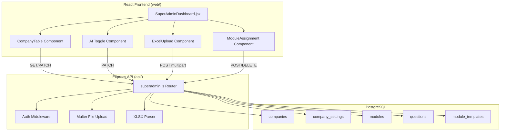
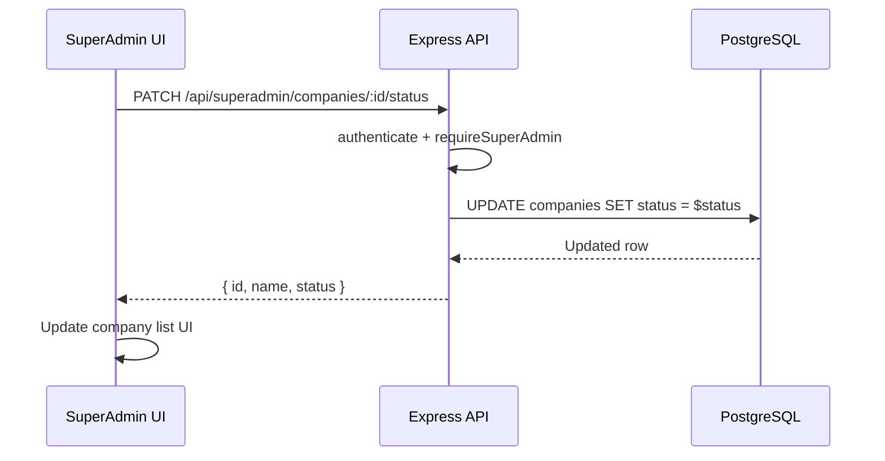
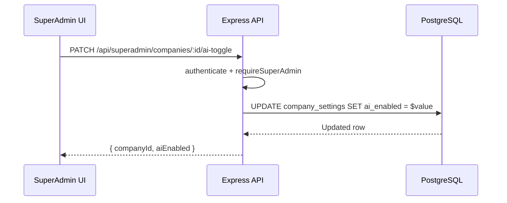
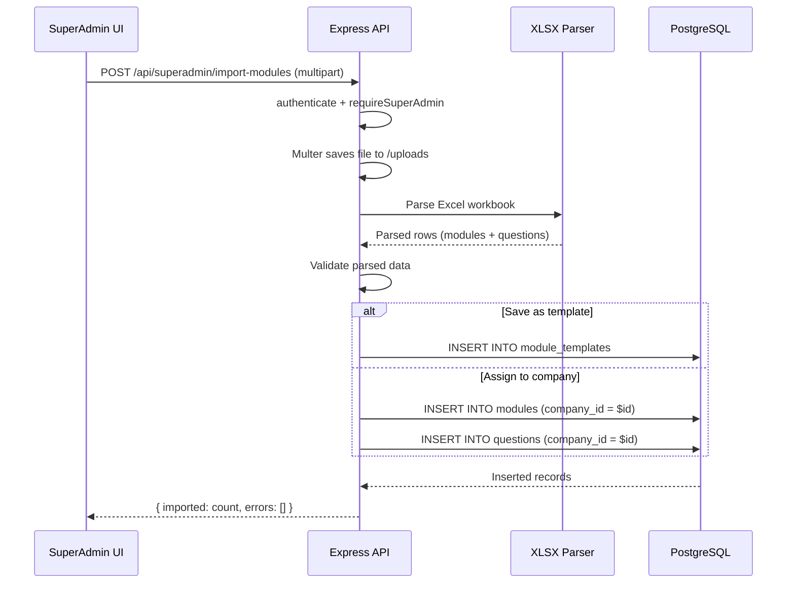
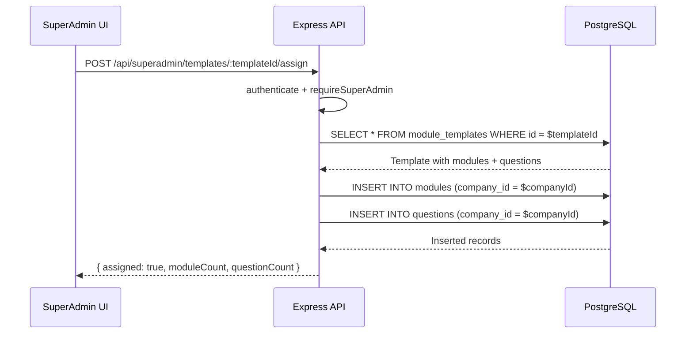

# Design Document: SuperAdmin Dashboard

## Overview

The SuperAdmin Dashboard is a platform-wide management interface that enables a privileged administrator to control multi-tenant company accounts. The feature extends the existing basic SuperAdmin interface with company lifecycle management (activate/deactivate), per-company AI feature toggling, and Excel-based bulk import of compliance modules and questions that can be assigned to specific companies or stored as reusable templates.

The system follows the existing Express + PostgreSQL API pattern and React frontend architecture. It leverages the already-installed `xlsx` library for Excel parsing on the backend, the existing JWT-based SUPERADMIN authentication, and the current `modules`/`questions` table schema with `company_id` nullable for global/template records.

## Architecture




## Sequence Diagrams

### Company Activation/Deactivation Flow



### AI Toggle Flow



### Excel Import Flow




### Module Assignment Flow



## Components and Interfaces

### Backend Components

#### Component 1: SuperAdmin Router (Extended)

**Purpose**: Handles all SuperAdmin API endpoints for company management, AI toggling, Excel import, and module assignment.

**Interface**:
```javascript
// Route definitions
GET    /api/superadmin/companies
PATCH  /api/superadmin/companies/:id/status
PATCH  /api/superadmin/companies/:id/ai-toggle
POST   /api/superadmin/import-modules
GET    /api/superadmin/templates
POST   /api/superadmin/templates/:templateId/assign
DELETE /api/superadmin/templates/:templateId
GET    /api/superadmin/companies/:id/modules
```

**Responsibilities**:
- Enforce SUPERADMIN-only access on all endpoints
- Manage company lifecycle (approve, suspend, reject)
- Toggle AI settings per company
- Parse and validate Excel uploads
- Store templates and assign modules to companies


#### Component 2: Excel Parser Module

**Purpose**: Parses uploaded Excel files into structured module and question data.

**Interface**:
```javascript
/**
 * Parse an Excel workbook and extract modules + questions.
 * @param {string} filePath - Path to the uploaded .xlsx file
 * @returns {{ modules: ParsedModule[], questions: ParsedQuestion[], errors: string[] }}
 */
function parseExcelImport(filePath) { ... }

/**
 * Validate parsed data against schema requirements.
 * @param {{ modules: ParsedModule[], questions: ParsedQuestion[] }} data
 * @returns {{ valid: boolean, errors: ValidationError[] }}
 */
function validateImportData(data) { ... }
```

**Responsibilities**:
- Read .xlsx/.xls files using the `xlsx` library
- Map spreadsheet columns to module/question fields
- Return structured data with validation errors

### Frontend Components

#### Component 3: SuperAdminDashboard (Enhanced)

**Purpose**: Main page with tabbed interface for company management, AI control, and module import.

**Interface**:
```javascript
// Props (same as current)
{ token, user, onLogout, theme, onThemeToggle }

// Internal state
{
  companies: Company[],
  templates: ModuleTemplate[],
  activeTab: 'companies' | 'modules' | 'import',
  loading: boolean
}
```

**Responsibilities**:
- Render tabbed UI (Companies, Modules, Import)
- Coordinate child components
- Handle global loading/error states


#### Component 4: CompanyManagementTable

**Purpose**: Displays all companies with inline controls for status and AI toggle.

**Interface**:
```javascript
// Props
{
  companies: Company[],
  onStatusChange: (companyId, newStatus) => Promise<void>,
  onAIToggle: (companyId, enabled) => Promise<void>
}
```

#### Component 5: ExcelUploadPanel

**Purpose**: File upload form with preview of parsed data and assignment options.

**Interface**:
```javascript
// Props
{
  token: string,
  companies: Company[],
  onImportComplete: () => void
}

// Internal state
{
  file: File | null,
  preview: { modules: [], questions: [] },
  targetCompanyId: number | null,
  saveAsTemplate: boolean,
  templateName: string,
  uploading: boolean,
  result: ImportResult | null
}
```

#### Component 6: ModuleAssignmentPanel

**Purpose**: List templates and assign them to companies.

**Interface**:
```javascript
// Props
{
  token: string,
  templates: ModuleTemplate[],
  companies: Company[],
  onAssign: (templateId, companyId) => Promise<void>,
  onDelete: (templateId) => Promise<void>
}
```

## Data Models

### New Table: module_templates

```sql
CREATE TABLE IF NOT EXISTS module_templates (
  id SERIAL PRIMARY KEY,
  name TEXT NOT NULL,
  description TEXT,
  file_name TEXT,
  module_data JSONB NOT NULL,
  question_data JSONB NOT NULL,
  created_by INT REFERENCES super_admins(id),
  created_at TIMESTAMPTZ NOT NULL DEFAULT NOW(),
  updated_at TIMESTAMPTZ NOT NULL DEFAULT NOW()
);
```


**Rationale**: Storing parsed Excel data as JSONB in a templates table allows reuse without re-upload. The SuperAdmin can assign a template to multiple companies. The `module_data` and `question_data` fields store arrays of parsed rows ready for insertion.

### Existing Table Modifications

No schema changes are needed for existing tables. The existing design already supports:
- `companies.status` — stores 'pending', 'approved', 'rejected' (we add 'suspended')
- `company_settings.ai_enabled` — boolean toggle already exists
- `modules.company_id` — nullable, NULL means global/template
- `questions.company_id` — nullable, NULL means global/template

### TypeScript-style Type Definitions

```javascript
/**
 * @typedef {Object} Company
 * @property {number} id
 * @property {string} name
 * @property {string} domain
 * @property {string} admin_email
 * @property {string} industry
 * @property {string} company_size
 * @property {'pending'|'approved'|'rejected'|'suspended'} status
 * @property {boolean} ai_enabled
 * @property {string} created_at
 */

/**
 * @typedef {Object} ModuleTemplate
 * @property {number} id
 * @property {string} name
 * @property {string} description
 * @property {string} file_name
 * @property {ParsedModule[]} module_data
 * @property {ParsedQuestion[]} question_data
 * @property {string} created_at
 */

/**
 * @typedef {Object} ParsedModule
 * @property {string} module_id
 * @property {string} name
 * @property {string} primary_owner
 * @property {string} frequency
 * @property {number} total_quests
 * @property {string} purpose
 */

/**
 * @typedef {Object} ParsedQuestion
 * @property {string} quest_id
 * @property {string} module_id
 * @property {string} module_name
 * @property {string} control_area
 * @property {string} iso_reference
 * @property {string} baseline_question
 * @property {string} level3_yes_criteria
 * @property {string} required_evidence
 * @property {string} default_owner
 * @property {string} frequency
 */

/**
 * @typedef {Object} ImportResult
 * @property {number} modulesImported
 * @property {number} questionsImported
 * @property {string[]} errors
 * @property {number|null} templateId - if saved as template
 */
```


## Key Functions with Formal Specifications

### Function 1: updateCompanyStatus()

```javascript
async function updateCompanyStatus(companyId, newStatus)
// Returns: { id, name, domain, status }
```

**Preconditions:**
- `companyId` is a positive integer referencing an existing company
- `newStatus` is one of: 'approved', 'rejected', 'suspended'
- Caller has SUPERADMIN role

**Postconditions:**
- Company record updated with new status and updated_at = NOW()
- Returns the updated company record
- If companyId doesn't exist, returns 404 error
- No side effects on other companies

### Function 2: toggleCompanyAI()

```javascript
async function toggleCompanyAI(companyId, aiEnabled)
// Returns: { companyId, aiEnabled }
```

**Preconditions:**
- `companyId` is a positive integer referencing an existing company
- `aiEnabled` is a boolean value
- A `company_settings` row exists for the company (or is created via upsert)

**Postconditions:**
- `company_settings.ai_enabled` is set to the provided value
- Returns confirmation with the new state
- If company doesn't exist, returns 404

### Function 3: parseExcelImport()

```javascript
function parseExcelImport(filePath)
// Returns: { modules: ParsedModule[], questions: ParsedQuestion[], errors: string[] }
```

**Preconditions:**
- `filePath` points to a valid .xlsx or .xls file on disk
- File contains at least one worksheet
- Expected column headers exist in the first row

**Postconditions:**
- Returns parsed module and question arrays
- `errors` array contains human-readable messages for any rows that couldn't be parsed
- Original file is not modified
- Empty rows are skipped
- All string values are trimmed

**Loop Invariants:**
- For each row processed: all previously parsed rows remain valid in the output arrays
- Error count is monotonically non-decreasing


### Function 4: importModulesToCompany()

```javascript
async function importModulesToCompany(parsedData, companyId, saveAsTemplate, templateName)
// Returns: ImportResult
```

**Preconditions:**
- `parsedData` has been validated (no critical errors)
- `companyId` is null (template-only) OR a valid company ID
- If `saveAsTemplate` is true, `templateName` is a non-empty string
- Database transaction is available

**Postconditions:**
- If `companyId` provided: modules and questions inserted with that company_id
- If `saveAsTemplate`: a module_templates record is created with the parsed data
- Duplicate module_id + company_id combinations are handled via ON CONFLICT (skip or update)
- Returns count of inserted modules, questions, and any row-level errors
- On failure, transaction is rolled back (no partial inserts)

**Loop Invariants:**
- For bulk insert loop: inserted count + error count = processed count
- Transaction remains open until all inserts complete or error occurs

### Function 5: assignTemplateToCompany()

```javascript
async function assignTemplateToCompany(templateId, companyId)
// Returns: { assigned: true, moduleCount, questionCount }
```

**Preconditions:**
- `templateId` references an existing module_templates row
- `companyId` references an existing, approved company
- Template's module_data and question_data are valid JSONB arrays

**Postconditions:**
- Modules from template inserted into `modules` table with target company_id
- Questions from template inserted into `questions` table with target company_id
- Duplicate handling: existing module_id for the same company are skipped (ON CONFLICT DO NOTHING)
- Returns count of successfully assigned modules and questions

## Algorithmic Pseudocode

### Excel Import Algorithm

```javascript
// Main import workflow
async function handleExcelImport(req, res) {
  // 1. Extract file from multer
  const filePath = req.file.path;
  const { companyId, saveAsTemplate, templateName } = req.body;

  // 2. Parse the Excel file
  const parsed = parseExcelImport(filePath);
  
  // 3. Validate parsed data
  if (parsed.errors.length > 0 && parsed.modules.length === 0) {
    return res.status(400).json({ errors: parsed.errors });
  }

  // 4. Begin transaction
  const client = await pool.connect();
  try {
    await client.query('BEGIN');

    let templateId = null;
    let modulesInserted = 0;
    let questionsInserted = 0;

    // 5. Optionally save as template
    if (saveAsTemplate) {
      const tpl = await client.query(
        `INSERT INTO module_templates (name, description, file_name, module_data, question_data, created_by)
         VALUES ($1, $2, $3, $4, $5, $6) RETURNING id`,
        [templateName, '', req.file.originalname, 
         JSON.stringify(parsed.modules), JSON.stringify(parsed.questions),
         req.user.userId]
      );
      templateId = tpl.rows[0].id;
    }

    // 6. If companyId provided, insert modules + questions
    if (companyId) {
      for (const mod of parsed.modules) {
        const result = await client.query(
          `INSERT INTO modules (module_id, company_id, name, primary_owner, frequency, total_quests, purpose)
           VALUES ($1, $2, $3, $4, $5, $6, $7)
           ON CONFLICT (company_id, module_id) DO NOTHING
           RETURNING id`,
          [mod.module_id, companyId, mod.name, mod.primary_owner, 
           mod.frequency, mod.total_quests, mod.purpose]
        );
        if (result.rows.length > 0) modulesInserted++;
      }

      for (const q of parsed.questions) {
        const result = await client.query(
          `INSERT INTO questions (quest_id, company_id, module_id, module_name, control_area,
           iso_reference, baseline_question, level3_yes_criteria, required_evidence,
           default_owner, frequency)
           VALUES ($1,$2,$3,$4,$5,$6,$7,$8,$9,$10,$11)
           ON CONFLICT (company_id, quest_id) DO NOTHING
           RETURNING id`,
          [q.quest_id, companyId, q.module_id, q.module_name, q.control_area,
           q.iso_reference, q.baseline_question, q.level3_yes_criteria,
           q.required_evidence, q.default_owner, q.frequency]
        );
        if (result.rows.length > 0) questionsInserted++;
      }
    }

    await client.query('COMMIT');
    
    // 7. Clean up uploaded file
    fs.unlinkSync(filePath);

    res.json({
      modulesImported: modulesInserted,
      questionsImported: questionsInserted,
      errors: parsed.errors,
      templateId
    });
  } catch (err) {
    await client.query('ROLLBACK');
    throw err;
  } finally {
    client.release();
  }
}
```


### Excel Parsing Algorithm

```javascript
function parseExcelImport(filePath) {
  const workbook = XLSX.readFile(filePath);
  const modules = [];
  const questions = [];
  const errors = [];

  // Strategy: Look for "Modules" sheet and "Questions" sheet
  // If not found, treat first sheet as questions (backward compatible)
  const moduleSheet = workbook.Sheets['Modules'] || workbook.Sheets['modules'];
  const questionSheet = workbook.Sheets['Questions'] || workbook.Sheets['questions'] 
                        || workbook.Sheets[workbook.SheetNames[0]];

  if (moduleSheet) {
    const rows = XLSX.utils.sheet_to_json(moduleSheet);
    for (let i = 0; i < rows.length; i++) {
      const row = rows[i];
      // INVARIANT: modules.length + errors from module parsing = i (for processed rows)
      if (!row.module_id && !row.ModuleID) {
        errors.push(`Modules sheet row ${i + 2}: missing module_id`);
        continue;
      }
      modules.push({
        module_id: String(row.module_id || row.ModuleID).trim(),
        name: String(row.name || row.Name || '').trim(),
        primary_owner: String(row.primary_owner || row.PrimaryOwner || '').trim(),
        frequency: String(row.frequency || row.Frequency || '').trim(),
        total_quests: parseInt(row.total_quests || row.TotalQuests || 0),
        purpose: String(row.purpose || row.Purpose || '').trim()
      });
    }
  }

  if (questionSheet) {
    const rows = XLSX.utils.sheet_to_json(questionSheet);
    for (let i = 0; i < rows.length; i++) {
      const row = rows[i];
      if (!row.quest_id && !row.QuestID) {
        errors.push(`Questions sheet row ${i + 2}: missing quest_id`);
        continue;
      }
      if (!row.module_id && !row.ModuleID) {
        errors.push(`Questions sheet row ${i + 2}: missing module_id`);
        continue;
      }
      questions.push({
        quest_id: String(row.quest_id || row.QuestID).trim(),
        module_id: String(row.module_id || row.ModuleID).trim(),
        module_name: String(row.module_name || row.ModuleName || '').trim(),
        control_area: String(row.control_area || row.ControlArea || '').trim(),
        iso_reference: String(row.iso_reference || row.ISOReference || '').trim(),
        baseline_question: String(row.baseline_question || row.BaselineQuestion || '').trim(),
        level3_yes_criteria: String(row.level3_yes_criteria || row.Level3YesCriteria || '').trim(),
        required_evidence: String(row.required_evidence || row.RequiredEvidence || '').trim(),
        default_owner: String(row.default_owner || row.DefaultOwner || '').trim(),
        frequency: String(row.frequency || row.Frequency || '').trim()
      });
    }
  }

  return { modules, questions, errors };
}
```


## Example Usage

### API Usage Examples

```javascript
// Example 1: Get all companies with their AI status
const response = await fetch('/api/superadmin/companies', {
  headers: { Authorization: `Bearer ${token}` }
});
// Returns: [{ id, name, domain, status, ai_enabled, ... }]

// Example 2: Suspend a company
await fetch('/api/superadmin/companies/5/status', {
  method: 'PATCH',
  headers: { Authorization: `Bearer ${token}`, 'Content-Type': 'application/json' },
  body: JSON.stringify({ status: 'suspended' })
});

// Example 3: Toggle AI for a company
await fetch('/api/superadmin/companies/5/ai-toggle', {
  method: 'PATCH',
  headers: { Authorization: `Bearer ${token}`, 'Content-Type': 'application/json' },
  body: JSON.stringify({ aiEnabled: false })
});

// Example 4: Upload Excel and assign to company
const formData = new FormData();
formData.append('file', excelFile);
formData.append('companyId', '5');
formData.append('saveAsTemplate', 'true');
formData.append('templateName', 'ISO 27001 Module Set');
await fetch('/api/superadmin/import-modules', {
  method: 'POST',
  headers: { Authorization: `Bearer ${token}` },
  body: formData
});

// Example 5: Assign existing template to another company
await fetch('/api/superadmin/templates/3/assign', {
  method: 'POST',
  headers: { Authorization: `Bearer ${token}`, 'Content-Type': 'application/json' },
  body: JSON.stringify({ companyId: 8 })
});
```

### Frontend Usage Example

```javascript
// In SuperAdminDashboard.jsx
const [activeTab, setActiveTab] = useState('companies');

// Company status change handler
const handleStatusChange = async (companyId, newStatus) => {
  await apiFetch(`/api/superadmin/companies/${companyId}/status`, {
    token,
    method: 'PATCH',
    body: { status: newStatus }
  });
  // Refresh company list
  fetchCompanies();
};

// AI toggle handler
const handleAIToggle = async (companyId, enabled) => {
  await apiFetch(`/api/superadmin/companies/${companyId}/ai-toggle`, {
    token,
    method: 'PATCH',
    body: { aiEnabled: enabled }
  });
  fetchCompanies();
};
```


## Correctness Properties

1. **Status Transition Integrity**: For all companies, `status` must be one of {'pending', 'approved', 'rejected', 'suspended'}. No other values can exist.

2. **AI Toggle Idempotency**: Toggling AI to the same value twice produces the same result. `toggleAI(id, true)` followed by `toggleAI(id, true)` leaves `ai_enabled = true`.

3. **Import Atomicity**: For any Excel import operation, either ALL modules and questions are inserted (success) OR none are inserted (rollback). No partial imports exist in the database.

4. **Template Reusability**: Assigning a template to a company does not modify or delete the template. The template remains available for future assignments.

5. **Duplicate Safety**: Importing the same Excel file twice for the same company does not create duplicate modules or questions (enforced by ON CONFLICT).

6. **Authorization Invariant**: All SuperAdmin endpoints return 403 for any non-SUPERADMIN caller. No company data is accessible without SUPERADMIN role.

7. **Parse Completeness**: For any valid Excel file, `parsedModules.length + parseErrors.length >= totalRows`. Every row is either successfully parsed or generates an error.

8. **Company Isolation**: Modules assigned to company A are never visible to company B's module queries (enforced by `company_id` filter in existing module routes).

## Error Handling

### Error Scenario 1: Invalid Excel File

**Condition**: Uploaded file is not a valid .xlsx/.xls or is corrupted
**Response**: Return 400 with `{ error: "Invalid file format. Please upload a valid Excel file (.xlsx or .xls)" }`
**Recovery**: File is deleted from uploads directory. User can retry with correct file.

### Error Scenario 2: Missing Required Columns

**Condition**: Excel file lacks required columns (module_id, quest_id)
**Response**: Return 400 with `{ errors: ["Row X: missing module_id", ...] }`
**Recovery**: Return detailed per-row errors so user can fix the spreadsheet.

### Error Scenario 3: Company Not Found

**Condition**: Provided companyId doesn't exist in database
**Response**: Return 404 with `{ error: "Company not found" }`
**Recovery**: Frontend shows error, user selects valid company.

### Error Scenario 4: Database Transaction Failure

**Condition**: Database error during bulk insert
**Response**: Transaction is rolled back. Return 500 with `{ error: "Import failed, no data was saved" }`
**Recovery**: User can retry. Uploaded file is cleaned up regardless.

### Error Scenario 5: File Too Large

**Condition**: Uploaded file exceeds size limit (10MB)
**Response**: Multer rejects with 413 status
**Recovery**: User must split into smaller files or reduce content.


## Testing Strategy

### Unit Testing Approach

- Test `parseExcelImport()` with various Excel fixtures (valid, empty, missing columns, extra columns)
- Test validation logic for status transitions
- Test AI toggle with edge cases (company without settings row)
- Mock database for route handler tests

### Property-Based Testing Approach

**Property Test Library**: fast-check (JavaScript)

- **Excel Parsing Roundtrip**: For any valid module/question data, serializing to Excel and parsing back yields equivalent data
- **Status Idempotency**: Applying the same status change twice yields the same database state
- **Template Assignment Consistency**: Assigning a template N times to the same company doesn't increase module count beyond one set

### Integration Testing Approach

- End-to-end flow: Upload Excel → verify modules appear in company's module list
- Template lifecycle: Create template → assign to company → verify → delete template → verify company still has modules
- Auth guard: Verify all endpoints reject non-SUPERADMIN tokens

## Performance Considerations

- **Bulk Inserts**: Use multi-row INSERT statements or `unnest()` for large Excel files (1000+ rows) instead of per-row inserts
- **File Size Limit**: Cap uploads at 10MB via Multer config to prevent memory issues
- **Template Storage**: JSONB storage is efficient for template data up to ~10,000 rows. For larger datasets, consider a separate normalized table
- **Company List**: With < 1000 companies, no pagination needed initially. Add cursor-based pagination if company count grows significantly

## Security Considerations

- **File Upload Validation**: Only accept `.xlsx` and `.xls` extensions. Validate MIME type (`application/vnd.openxmlformats-officedocument.spreadsheetml.sheet`)
- **Path Traversal**: Multer's `destination` config prevents path traversal. Files stored in `/app/uploads/` only
- **SQL Injection**: All queries use parameterized `$1, $2...` placeholders (already the project pattern)
- **Authorization**: Double-check via `requireSuperAdmin` middleware on every route
- **File Cleanup**: Always delete uploaded files after processing (success or failure)
- **Input Sanitization**: Trim and validate all parsed Excel cell values before database insertion

## Dependencies

### Existing (no new packages needed)

| Package | Version | Purpose |
|---------|---------|---------|
| express | ^4.19.2 | HTTP framework |
| multer | ^1.4.5-lts.1 | File upload handling |
| xlsx | ^0.18.5 | Excel file parsing |
| pg | ^8.12.0 | PostgreSQL client |
| jsonwebtoken | ^9.0.2 | JWT auth |
| bcryptjs | ^2.4.3 | Password hashing |

### Frontend (no new packages needed)

The React frontend uses vanilla `fetch` via the existing `apiFetch` utility. No additional UI libraries are required — the existing CSS class system (`.data-table`, `.btn`, `.page-container`) provides sufficient styling.
